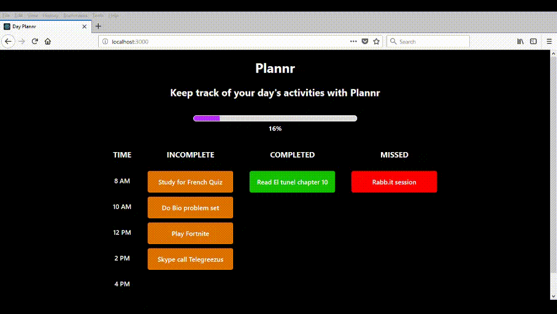

# Plannr

This is a personal task management app that allows the user to keep track of the progress of their tasks.

Currently in development to add more functionality and sync with timetable.

## Usage

In the project directory you should run:

### `npm install`

Installs the project dependencies on your local computer.

### `npm start`

Runs the app in the development mode. 
Open [http://localhost:3000](http://localhost:3000) to view it in the browser.

The page will reload if you make edits. 
You will also see any lint errors in the console.
